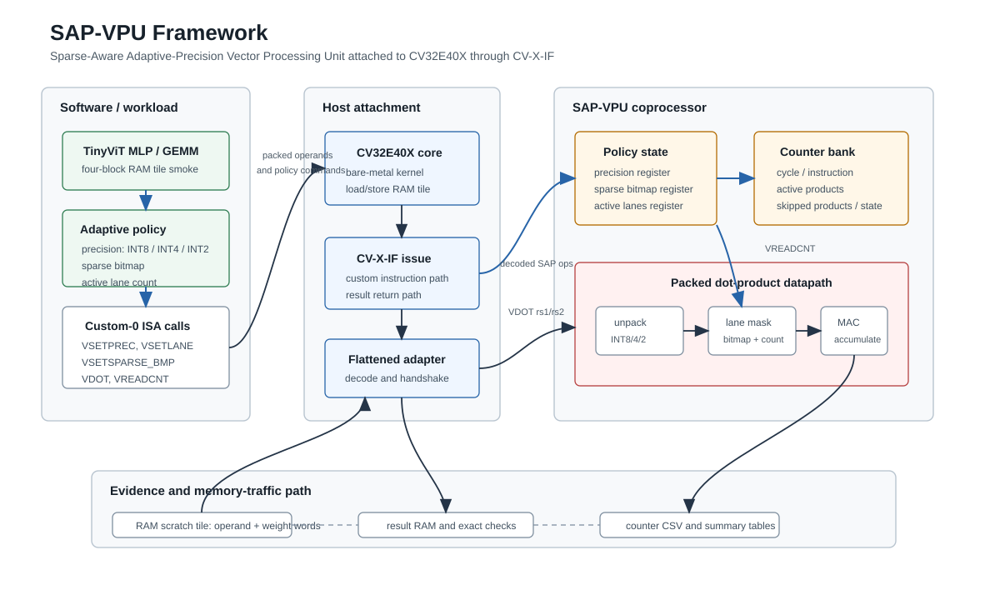

# SAP-VPU Framework Diagram

This page records the current architecture-level framework figure for SAP-VPU.
It is intended as a paper-planning diagram, not as a final publication figure.

## Reading Notes

- The software side models TinyViT MLP/GEMM tiles and selects precision, sparse
  bitmap, and active-lane policy.
- CV32E40X issues SAP custom-0 instructions through the flattened CV-X-IF
  adapter without modifying the scalar core source.
- SAP-VPU keeps policy state, executes packed INT8/INT4/INT2 dot products with
  sparse and lane gating, and exposes cycle, instruction, active-product,
  skipped-product, sparse-state, and lane-state counters.
- The current evidence path uses a RAM scratch tile for operand/weight words,
  exact result checks, and CSV counter summaries.
